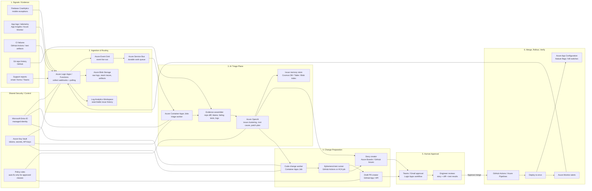

#Diagram

```mermaid
flowchart LR
    subgraph Sources["1. Signals / Evidence"]
        A1["Firebase Crashlytics<br/>mobile exceptions"]
        A2["App logs / telemetry<br/>App Insights / Azure Monitor"]
        A3["CI failures<br/>GitHub Actions / test artifacts"]
        A4["Git repo history<br/>GitHub"]
        A5["Support reports<br/>email / forms / Teams"]
    end

    subgraph Ingest["2. Ingestion & Routing"]
        B1["Azure Logic Apps / Functions<br/>collect webhooks + polling"]
        B2["Azure Event Grid<br/>event fan-out"]
        B3["Azure Service Bus<br/>durable work queue"]
        B4["Azure Blob Storage<br/>raw logs, stack traces, artifacts"]
        B5["Log Analytics Workspace<br/>searchable issue history"]
    end

    subgraph Triage["3. AI Triage Plane"]
        C1["Azure Container Apps Jobs<br/>triage worker"]
        C2["Azure OpenAI<br/>issue clustering, root cause, patch plan"]
        C3["Evidence assembler<br/>repo diff, blame, failing tests, logs"]
        C4["Issue memory store<br/>Cosmos DB / Table / Blob index"]
    end

    subgraph Action["4. Change Preparation"]
        D1["Code-change worker<br/>Container Apps Job"]
        D2["Ephemeral test runner<br/>GitHub Actions or ACA job"]
        D3["Draft PR creator<br/>GitHub App / API"]
        D4["Story creator<br/>Azure Boards / GitHub Issues"]
    end

    subgraph Human["5. Human Approval"]
        E1["Teams / Email approval<br/>Logic Apps workflow"]
        E2["Engineer reviews<br/>story + diff + test results"]
    end

    subgraph Delivery["6. Merge, Rollout, Verify"]
        F1["GitHub Actions / Azure Pipelines"]
        F2["Deploy to envs"]
        F3["Azure App Configuration<br/>feature flags / kill switches"]
        F4["Azure Monitor alerts"]
    end

    subgraph Security["Shared Security / Control"]
        S1["Microsoft Entra ID<br/>managed identity"]
        S2["Azure Key Vault<br/>tokens, secrets, API keys"]
        S3["Policy rules<br/>auto-fix only for approved classes"]
    end

    A1 --> B1
    A2 --> B1
    A3 --> B1
    A4 --> C3
    A5 --> B1

    B1 --> B2
    B1 --> B4
    B1 --> B5
    B2 --> B3

    B3 --> C1
    C1 --> C3
    C3 --> C2
    C2 --> C4
    C2 --> D4
    C2 --> D1

    D1 --> D2
    D2 --> D3
    D2 --> D4

    D3 --> E1
    D4 --> E1
    E1 --> E2

    E2 -->|Approve merge| F1
    F1 --> F2
    F2 --> F3
    F2 --> F4
    F4 --> B1

    S1 --- B1
    S1 --- C1
    S1 --- D1
    S2 --- B1
    S2 --- C1
    S2 --- D1
    S3 --- C2
    S3 --- D3

```